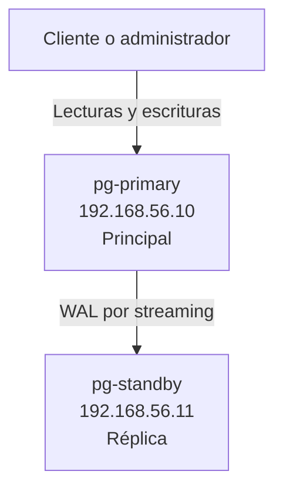
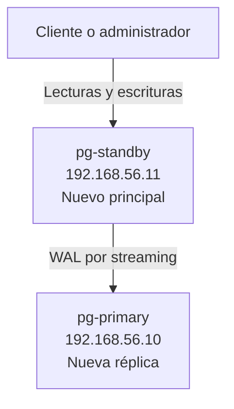

# Arquitectura del laboratorio

## Descripción general

El laboratorio utiliza dos máquinas virtuales con PostgreSQL 16. El servidor principal recibe lecturas y escrituras, genera registros WAL y los transmite a una réplica física mediante replicación en *streaming*.

## Componentes

| Componente | Función |
|---|---|
| VirtualBox | Ejecutar las máquinas virtuales |
| Ubuntu Server 26.04 LTS | Sistema operativo de los servidores |
| PostgreSQL 16 | Sistema gestor de bases de datos |
| OpenSSH Server | Administración remota |
| Git y GitHub | Control de versiones y publicación |

## Máquinas virtuales

| Nombre | IP privada | Recursos | Función inicial |
|---|---:|---|---|
| `pg-primary` | `192.168.56.10` | 2 CPU, 2 GB RAM, 25 GB | Principal |
| `pg-standby` | `192.168.56.11` | 2 CPU, 2 GB RAM, 25 GB | Réplica |

Cada VM tiene dos adaptadores:

- Adaptador 1 en modo NAT para acceder a Internet.
- Adaptador 2 en modo solo-anfitrión para la comunicación privada.

## Flujo inicial

## Flujo posterior al failover

## Alcance

La solución demuestra replicación y failover manual. No incluye un gestor automático de alta disponibilidad, una IP virtual, balanceo de carga ni protección automática frente a *split-brain*.
